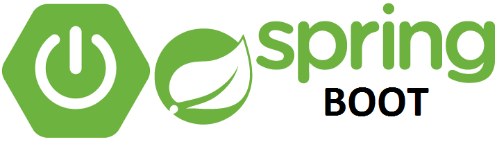

  

<h2 align="center">Learn Spring Boot</h2>

   

---

 Using this repository to record all implementation programs performed during Spring Boot Training.
    
  <b>Start Date:</b> 06/29/2021 

### ⛏️ Software

`JAVA Version: "1.8.0_281" ` 
`Eclipse Version: "2021-06" (4.20.0)` 
`Maven "3.8.1"` 
`Spring Tool Suite 4` 

